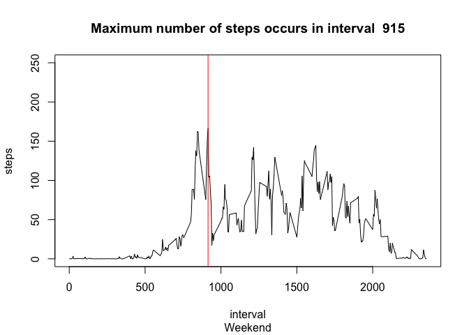

# Reproducible Research: Peer Assessment 1


## Loading and preprocessing the data

```r
unzip("activity.zip")
raw <- read.csv("activity.csv")
summary(raw)
```

```
##      steps                date          interval     
##  Min.   :  0.00   2012-10-01:  288   Min.   :   0.0  
##  1st Qu.:  0.00   2012-10-02:  288   1st Qu.: 588.8  
##  Median :  0.00   2012-10-03:  288   Median :1177.5  
##  Mean   : 37.38   2012-10-04:  288   Mean   :1177.5  
##  3rd Qu.: 12.00   2012-10-05:  288   3rd Qu.:1766.2  
##  Max.   :806.00   2012-10-06:  288   Max.   :2355.0  
##  NA's   :2304     (Other)   :15840
```


## What is mean total number of steps taken per day?

```r
daily <- aggregate(steps ~ date, data=raw, sum)
summary(daily)
```

```
##          date        steps      
##  2012-10-02: 1   Min.   :   41  
##  2012-10-03: 1   1st Qu.: 8841  
##  2012-10-04: 1   Median :10765  
##  2012-10-05: 1   Mean   :10766  
##  2012-10-06: 1   3rd Qu.:13294  
##  2012-10-07: 1   Max.   :21194  
##  (Other)   :47
```

```r
plot(daily)
abline(h=mean(daily$steps), col="green")
```

 

```r
hist(daily$steps, breaks=25)
abline(v=median(daily$steps), col="red", lwd=3)
abline(v=mean(daily$steps), col="green")
```

 

The average total daily steps has a mean of 10766 and a median of 10765.

## What is the average daily activity pattern?

```r
library(ggplot2)
qplot(date, steps, data=raw)
```

```
## Warning: Removed 2304 rows containing missing values (geom_point).
```

 

```r
pat <- aggregate(steps ~ interval, data=raw, mean)
maxSteps <- pat[pat$steps==max(pat$steps),]
plot(pat, type='l')
title(main=paste('Maximum number of steps occurs in interval ',maxSteps$interval))
abline(v=maxSteps$interval, col="red")
```

 

Average daily activity starts after 5:00 AM and peaks around 8:30 AM followed by three peaks of activity around noon, 3:30 PM and evening.

## Imputing missing values

```r
mv <- is.na(raw$steps)
sum(mv)
```

```
## [1] 2304
```

```r
tidy <- raw
for (i in 1:length(tidy$steps)) {
  if (is.na(tidy$steps[i])) {
    s <- mean(tidy$steps[tidy$interval==tidy$interval[i]],na.rm=TRUE)
    if (is.na(s))
      tidy$steps[i] = 0
    else
      tidy$steps[i] = s
  }
}
tidyDaily <- aggregate(steps ~ date, data = tidy, sum)
par(mfrow=c(1,2))
hist(daily$steps, breaks=25, ylim=c(0,20), main="Histogram of Raw Data")
abline(v=median(daily$steps), col="red", lwd=3)
abline(v=mean(daily$steps), col="green")
hist(tidyDaily$steps, breaks=25, ylim=c(0,20), main="Histogram w/ Mean Imputed Data")
abline(v=median(tidyDaily$steps), col="red", lwd=3)
abline(v=mean(tidyDaily$steps), col="green")
```

 

```r
summary(daily)
```

```
##          date        steps      
##  2012-10-02: 1   Min.   :   41  
##  2012-10-03: 1   1st Qu.: 8841  
##  2012-10-04: 1   Median :10765  
##  2012-10-05: 1   Mean   :10766  
##  2012-10-06: 1   3rd Qu.:13294  
##  2012-10-07: 1   Max.   :21194  
##  (Other)   :47
```

```r
summary(tidyDaily)
```

```
##          date        steps      
##  2012-10-01: 1   Min.   :   41  
##  2012-10-02: 1   1st Qu.: 9819  
##  2012-10-03: 1   Median :10766  
##  2012-10-04: 1   Mean   :10766  
##  2012-10-05: 1   3rd Qu.:12811  
##  2012-10-06: 1   Max.   :21194  
##  (Other)   :55
```

```r
sum(daily$steps)
```

```
## [1] 570608
```

```r
sum(tidyDaily$steps)
```

```
## [1] 656737.5
```

Missing data is imputed with the mean value of the corresponding interval period, unless that value is also NA. Then the missing value is set to zero.

Imputing the missing data for steps does little to change the statistics of the data. Daily steps increased from 570608 to 656737. However, this imputed data shows up in the peak histogram column around the mean: raw data - 10766 vs. imputed data - 10766.

## Are there differences in activity patterns between weekdays and weekends?

```r
tidy$wday <- factor(weekdays(as.Date(tidy$date, "%Y-%m-%d")) %in% c("Saturday", "Sunday"), labels=c("weekday", "weekend"))
summary(tidyDaily)
```

```
##          date        steps      
##  2012-10-01: 1   Min.   :   41  
##  2012-10-02: 1   1st Qu.: 9819  
##  2012-10-03: 1   Median :10766  
##  2012-10-04: 1   Mean   :10766  
##  2012-10-05: 1   3rd Qu.:12811  
##  2012-10-06: 1   Max.   :21194  
##  (Other)   :55
```

```r
pat <- aggregate(steps ~ interval, data=tidy[tidy$wday=="weekday",], mean)
maxSteps <- pat[pat$steps==max(pat$steps),]
plot(pat, type='l', ylim=c(0,250))
title(main=paste('Maximum number of steps occurs in interval ',maxSteps$interval), sub="Weekday")
abline(v=maxSteps$interval, col="red")
```

 

```r
pat2 <- aggregate(steps ~ interval, data=tidy[tidy$wday=="weekend",], mean)
maxSteps <- pat2[pat2$steps==max(pat2$steps),]
plot(pat2, type='l', ylim=c(0,250))
title(main=paste('Maximum number of steps occurs in interval ',maxSteps$interval), sub="Weekend")
abline(v=maxSteps$interval, col="red")
```

 

Weekend activity differs from Weekday activity in that activity starts later in the morning, and there are several simular peak activity periods throughout the day.
